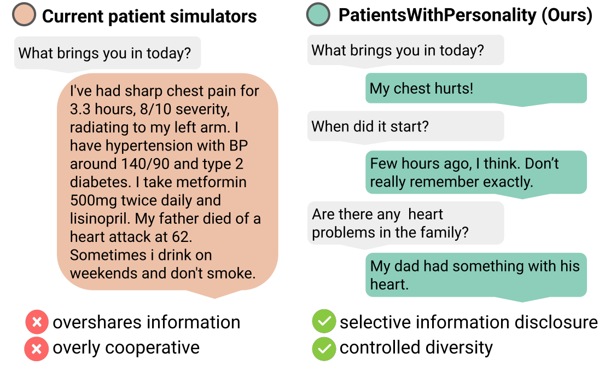
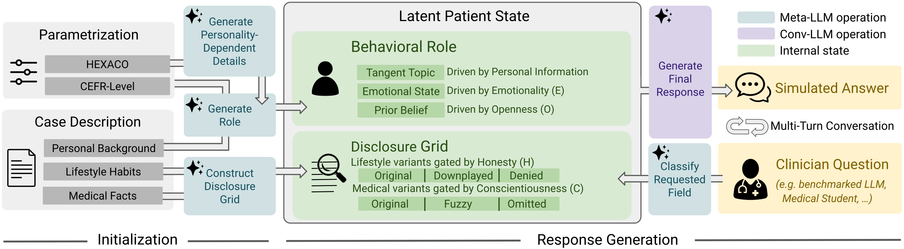

<div align="center">

# 🩺 Patients With Personality

### Realistic Patient Simulation through Controlled Diversity and Selective Disclosure

[Moritz Schlager](https://scholar.google.com/citations?user=lMvbxhoAAAAJ&hl=en), [Friederike Jungmann](https://kiinformatik.mri.tum.de/de/team/friederike_jungmann), [Samuel Schmidgall](https://scholar.google.com/citations?user=bQDooZEAAAAJ&hl=en), Philipp Raffler, Franziska Hartl, Eva Wende, Paula Roßmüller, Conrad Ketzer, [Avinatan Hassidim](https://scholar.google.com/citations?user=CnBvgwcAAAAJ&hl=en), [Dale R. Webster](https://scholar.google.com/citations?user=qAqGfk0AAAAJ&hl=en), [Yossi Matias](https://scholar.google.com/citations?user=IwSe1-MAAAAJ&hl=en), [Yun Liu](https://scholar.google.com/citations?user=EojZy50AAAAJ&hl=en), [Daniel Rueckert](https://scholar.google.com/citations?user=H0O0WnQAAAAJ&hl=en), [Mike Schaekermann](https://scholar.google.com/citations?user=mwj_ldQAAAAJ&hl=en), [Paul Hager](https://scholar.google.com/citations?user=ESLUtGAAAAAJ&hl=en)

<p>

[](https://arxiv.org/abs/2606.17441)
[](https://mo374z.github.io/PatientsWithPersonality/)
[](https://www.python.org/)
[](https://github.com/astral-sh/uv)

</p>

</div>

---

This repository contains the full code for the paper: the **PWP simulator**, **re-implementations of five prior patient simulators** under a shared interface, the **Hydra-configured evaluation pipeline**, and the **Streamlit/Dash GUIs** used in the clinician study.

## Motivation

<p align="center">
  
</p>

Realistic patient simulation is needed to benchmark clinical LLMs at scale without time-consuming, expensive user studies. Yet existing simulators behave unlike real patients: prompted with a single question, they dump the entire case — diagnoses, medications, family history, lifestyle — in one overly cooperative turn. Real patients disclose selectively, recall imperfectly, and vary widely in how they communicate. PWP closes this gap by parametrizing patient behavior over personality, so a virtual patient reveals only what is asked, the way a real person would.

## Highlights

- 🧬 **Parametrizable Personas** — six personality axes (Honesty-Humility, Emotionality, Extraversion, Agreeableness, Conscientiousness, Openness) give fine-grained, recoverable control over how a patient behaves.
- 🤐 **Selective disclosure of information** — patients reveal information only when prompted, preventing the unprompted oversharing that plagues prior simulators.
- 🎭 **Diverse Population Coverage** — configured traits span a substantially wider behavioral footprint than the closest baseline.
- 👩‍⚕️ **Validated by Real Clinicians** — judged nearly as realistic as recorded human actors in a blinded clinician study.
- 🔬 **Reproducible evaluation** — Hydra-configured experiment suite spanning multiple simulators and LLM backends.

## Framework

<p align="center">
  
</p>

PWP separates a one-time **initialization** from per-turn **response generation**, mediated by a **latent patient state**.

**Initialization.** A case description (personal background, lifestyle habits, medical facts) and a personality parametrization (HEXACO traits + CEFR language level) are combined by meta-LLM operations into:

- a **behavioral role** — tangent topics drawn from personal information, an emotional state driven by Emotionality (E), and prior beliefs driven by Openness (O);
- a **disclosure grid** — lifestyle fields in truthful / downplayed / denied variants gated by Honesty-Humility (H), and medical facts in original / fuzzy / omitted variants gated by Conscientiousness (C).

**Response generation.** For each clinician question, a meta-LLM classifies which case field is being requested, the latent state selects the appropriate disclosure variant, and the conversational LLM generates the final answer. This repeats across the multi-turn conversation, so disclosure evolves naturally and the patient never overshares.


## Patient Simulators

The repository implements PWP alongside re-implementations of prior simulators under a common interface in [`patient_simulator/patients/`](patient_simulator/patients/).

| Simulator | Reference | Summary |
|---|---|---|
| **PatientsWithPersonality** | *Ours* | HEXACO-grounded realistic recall and selective disclosure over a latent patient state. |
| `BaselinePatient` | — | Rephrases the ground-truth transcript responses. Lower-bound baseline with access to gold answers. |
| `VirtualPatient` | [Zhang et al., 2025](https://arxiv.org/abs/2511.14783) | Single-turn system prompt rebuilt each turn from a JSON case and a rolling history window. |
| `CraftMDPatient` | [Johri et al., 2023](https://www.medrxiv.org/content/10.1101/2023.09.12.23295399v2) | Prompt-based simulation; responses kept to one layman sentence. |
| `AgentClinicPatient` | [Schmidgall et al., 2024](https://arxiv.org/abs/2405.07960) | Dialogue simulation supporting 11 cognitive and social biases. |
| `StateAwarePatient` | [Liao et al., 2024](https://arxiv.org/abs/2403.08495) | State tracker + three-tier memory bank for precise behavioral control. |
| `PatientSimPatient` | [Kyung et al., 2025](https://arxiv.org/abs/2505.17818) | Persona axes: CEFR level, personality, memory recall, dazedness. |

## Installation

The project uses [`uv`](https://github.com/astral-sh/uv) and targets Python 3.12.

```bash
git clone https://github.com/mo374z/PatientsWithPersonality.git
cd PatientsWithPersonality
uv sync
```

Provide API credentials by copying the example key file and filling in your values:

```bash
cp keys.json.example keys.json
```

## Quickstart

Experiments are configured with [Hydra](https://hydra.cc/); configs live in [`configs/experiment/`](configs/experiment/).

```bash
# Compare simulators on the default case set
uv run python scripts/run_patient_comparison.py
```

| Script | Purpose |
|---|---|
| `scripts/run_patient_comparison.py` | Run and evaluate all simulators side by side. |
| `scripts/run_metaprompt_tuning.py` | Tune the meta-prompts driving the simulator. |
| `scripts/run_posthoc_eval.py` | Re-score existing conversation results. |
| `scripts/run_llm_feasibility.py` | Probe LLM-backend feasibility. |

Model backends are swappable via the configs under [`configs/experiment/models/`](configs/experiment/models/) (Claude, Gemini, GPT, Qwen, Ministral, …).

## Interactive GUIs

### Simulator playground & evaluation explorer (Streamlit)

```bash
# Chat live with a configurable virtual patient
uv run streamlit run frontend/app.py --server.port 8555

# Inspect evaluated conversations turn by turn
uv run streamlit run frontend/evaluation_explorer.py
```

See [`frontend/README.md`](frontend/README.md) for the full feature list and the HEXACO configuration controls.

### Clinician labeling GUI (Dash)

```bash
uv run python labeling-gui/app.py \
  --results-dir results/patient_comparison_default/ \
  --study-config labeling-gui/study_config.yaml \
  --data-dir data/
```

Adjust patient names and case lists in the `study_config_*.yaml` files before starting. Labels are written to `labeling-gui/labels_realism/` and `labeling-gui/labels_personality/` (override with `--labels-dir`).

## Repository Structure

```
patient_simulator/      Core library
  patients/             Simulator implementations (PWP + baselines)
  prompts/              Patient and evaluation prompts
  misc/                 LLM clients, plotting, metrics, utilities
  eval.py               Evaluation pipeline
configs/experiment/     Hydra experiment + model configs
scripts/                Experiment entry points
frontend/               Streamlit playground & evaluation explorer
labeling-gui/           Dash clinician labeling app
notebooks/              Analysis notebooks and paper figures
tests/                  Tests
```

## Citation

If you find this work useful, please cite:

```bibtex
@article{schlager2026patients,
  title   = {Patients With Personality: Realistic Patient Simulation through Controlled Diversity and Selective Disclosure},
  author  = {Schlager, Moritz and Jungmann, Friederike and Schmidgall, Samuel and Raffler, Philipp and Hartl, Franziska and Wende, Eva and Ro{\ss}m{\"u}ller, Paula and Ketzer, Conrad and Hassidim, Avinatan and Webster, Dale R. and Matias, Yossi and Liu, Yun and Rueckert, Daniel and Schaekermann, Mike and Hager, Paul},
  journal = {arXiv preprint arXiv:2606.17441},
  year    = {2026}
}
```
